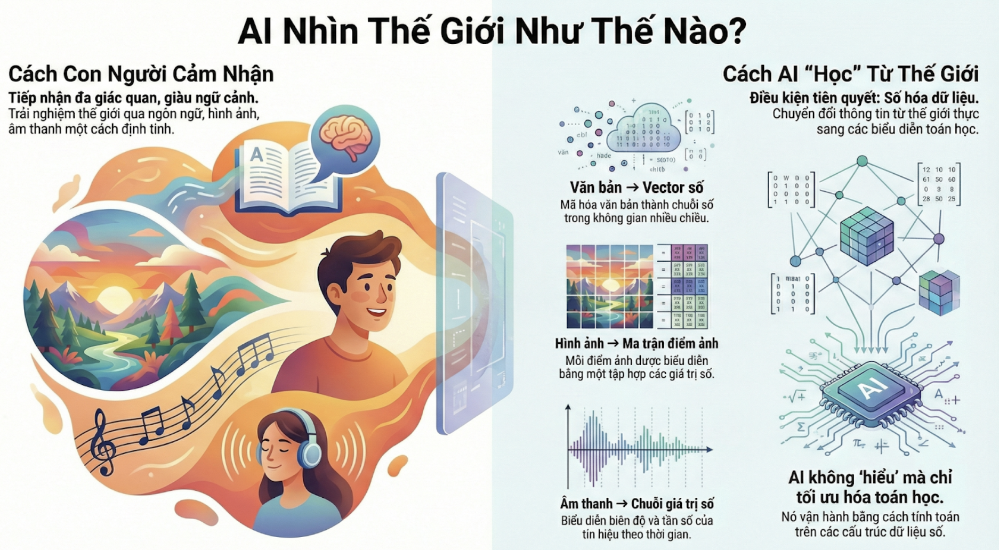
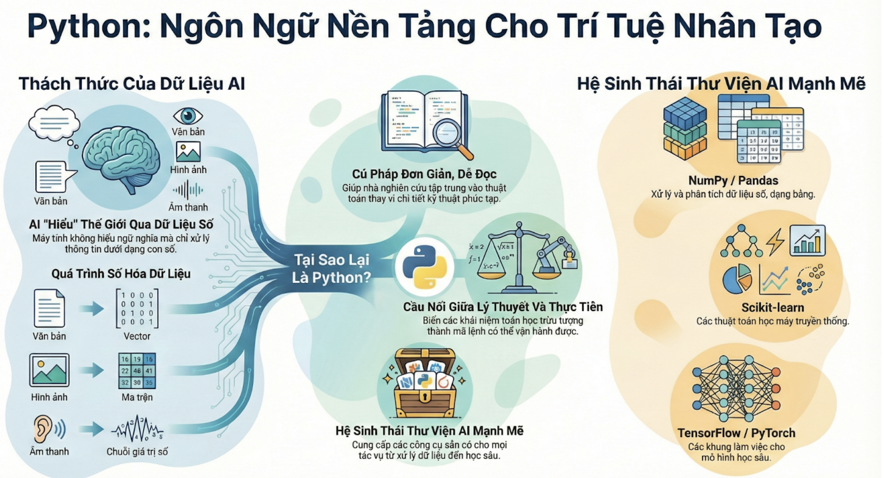
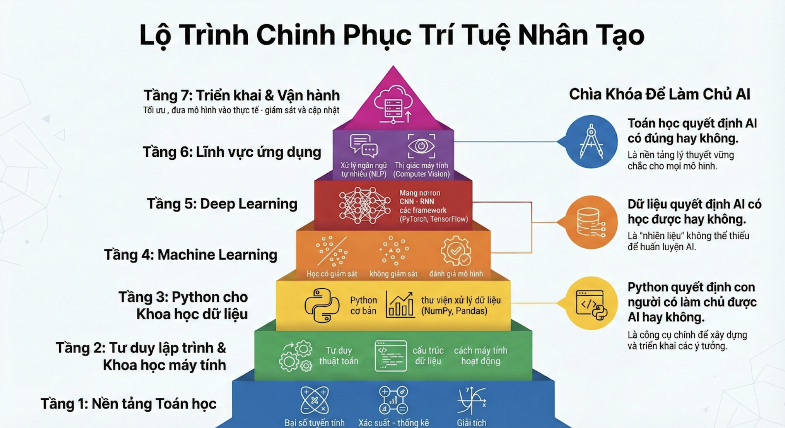
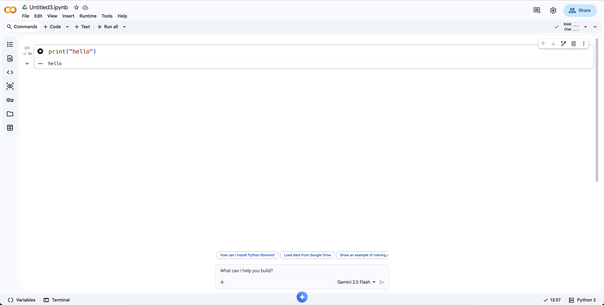
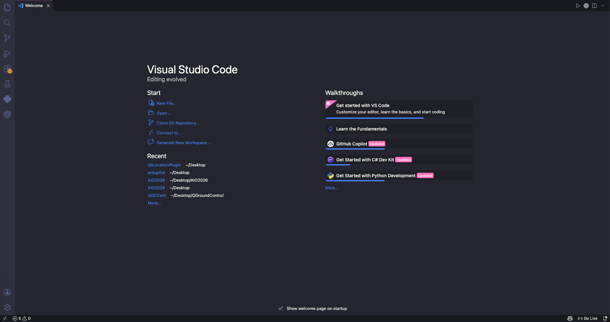
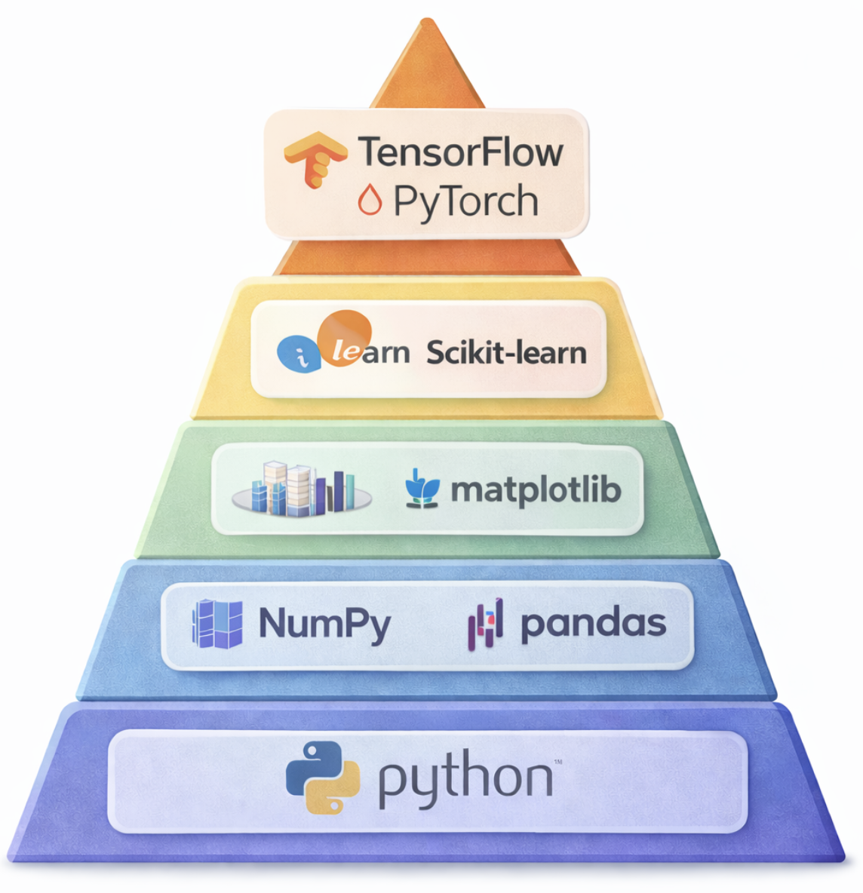

# Học Python cho AI  
*Từ ngôn ngữ lập trình đến trí tuệ nhân tạo*

---
>  **Chủ đề:** Python cho Trí tuệ Nhân tạo  
>  **Đối tượng:** Người mới học AI / Data / ML  
>  **Thời gian đọc:** ~30–40 phút  
>  **Mục tiêu:** Hiểu vai trò của Python trong hệ sinh thái AI

## 1. Lý do học Python cho việc học AI
Trí tuệ nhân tạo (Artificial Intelligence – AI) thường được nhìn nhận như một công nghệ mang tính đột phá, thậm chí vượt ra ngoài khả năng kiểm soát của con người. Tuy nhiên, từ góc độ khoa học, AI không phải là một thực thể siêu hình mà là kết quả của sự kết hợp giữa toán học, khoa học máy tính và dữ liệu nhằm mô phỏng một phần năng lực nhận thức của con người.

Để triển khai và kiểm soát các mô hình AI, con người cần một ngôn ngữ lập trình đóng vai trò trung gian giữa tư duy trừu tượng và khả năng xử lý của máy tính. Trong bối cảnh đó, Python đã trở thành ngôn ngữ được lựa chọn rộng rãi trong nghiên cứu và ứng dụng AI.
### 1.1. Bản chất của dữ liệu trong Trí tuệ Nhân tạo

<div align="center">
  
  <p><em>Dữ liệu từ thế giới thực được số hóa để máy có thể học.</em></p>
</div>

Con người tiếp nhận thế giới thông qua nhiều kênh cảm giác khác nhau như ngôn ngữ, hình ảnh và âm thanh. Những trải nghiệm này mang tính định tính, giàu ngữ cảnh và gắn liền với ý nghĩa. Ngược lại, hệ thống máy tính chỉ có khả năng xử lý thông tin dưới dạng dữ liệu số.
Do đó, điều kiện tiên quyết để máy tính có thể “học” là việc chuyển đổi dữ liệu từ thế giới thực sang các biểu diễn toán học phù hợp.
* Trong xử lý ngôn ngữ tự nhiên (Natural Language Processing – NLP), văn bản được mã hóa thành các chuỗi ký tự và sau đó được biểu diễn dưới dạng vector số trong không gian nhiều chiều.
* Trong thị giác máy tính (Computer Vision), hình ảnh được biểu diễn bằng các ma trận điểm ảnh, trong đó mỗi điểm ảnh tương ứng với một tập giá trị số.
* Trong xử lý âm thanh, tín hiệu được số hóa thành các chuỗi giá trị thể hiện biên độ và tần số theo thời gian.

Như vậy, AI không “hiểu” dữ liệu theo nghĩa ngữ nghĩa của con người, mà vận hành thông qua việc tối ưu các mô hình toán học trên những cấu trúc dữ liệu số hóa.

### 1.2. Python trong vai trò ngôn ngữ trung gian

<div align="center">
  
  <p><em>Python giúp hiện thực hóa mô hình AI một cách trực quan và linh hoạt.</em></p>
</div>
1. Đặc điểm ngôn ngữ và khả năng tiếp cận

Python được thiết kế với cú pháp đơn giản và dễ đọc, gần với ngôn ngữ tự nhiên. Đặc điểm này giúp người nghiên cứu và ứng dụng AI tập trung vào bản chất của mô hình và thuật toán, thay vì phải xử lý các chi tiết kỹ thuật phức tạp của ngôn ngữ lập trình cấp thấp.

Trong bối cảnh nghiên cứu AI, nơi quá trình thử nghiệm và điều chỉnh mô hình diễn ra liên tục, tính linh hoạt và khả năng đọc hiểu cao của Python mang lại lợi thế đáng kể.

2. Hệ sinh thái thư viện hỗ trợ AI

Sự phổ biến của Python trong AI không chỉ đến từ bản thân ngôn ngữ mà còn từ hệ sinh thái thư viện phong phú và trưởng thành:
* NumPy: cung cấp nền tảng cho các phép toán mảng và đại số tuyến tính.
* Pandas: hỗ trợ xử lý, làm sạch và phân tích dữ liệu dạng bảng.
* Scikit-learn: triển khai các thuật toán học máy truyền thống.
* TensorFlow và PyTorch: khung làm việc cho các mô hình học sâu và mạng nơ-ron nhân tạo.
* Matplotlib và Seaborn: phục vụ trực quan hóa dữ liệu và kết quả mô hình.

Những thư viện này cho phép người dùng tiếp cận trực tiếp các phương pháp nghiên cứu tiên tiến mà không cần tái triển khai các thuật toán từ đầu.

3. Vai trò của Python trong quy trình phát triển AI

Python không thay thế kiến thức toán học hay tư duy thuật toán. Thay vào đó, Python đóng vai trò là công cụ hiện thực hóa các mô hình toán học thành hệ thống có thể thử nghiệm, đánh giá và cải tiến.

Thông qua Python, các khái niệm trừu tượng như vector, ma trận, hàm mất mát hay thuật toán tối ưu được triển khai thành mã lệnh có thể vận hành trên dữ liệu thực tế. Điều này giúp rút ngắn khoảng cách giữa nghiên cứu lý thuyết và ứng dụng thực tiễn.

## 2. Bức tranh tổng thể của AI và vai trò của Python  

### 2.1. Vì sao cần nhìn AI dưới dạng “bức tranh tổng thể”?

<div align="center">
  
</div>

Một trong những nguyên nhân phổ biến khiến người học AI dễ nản hoặc đi sai hướng là tiếp cận AI theo từng mảnh rời rạc và không có định hướng rõ ràng: học Python trước, rồi thấy cần toán; học toán xong lại không biết áp dụng vào đâu; xem mô hình AI nhưng không hiểu dữ liệu đến từ đâu. Thực tế, AI là một cấu trúc nhiều tầng, người học cần nhìn nhận được tổng thể trước khi đi vào từng thành phần cụ thể.

### 2.2. AI như một hệ thống nhiều lớp (layered system)

Ở mức khái quát, có thể xem AI như một “ngăn xếp” (stack) kiến thức, đi từ nền tảng trừu tượng đến ứng dụng thực tiễn. Mỗi tầng không tồn tại độc lập mà phụ thuộc chặt chẽ vào các tầng bên dưới.

Lộ trình học AI – góc nhìn tổng quan

<div align="center">
  
  <p><em>Lộ trình học AI theo tầng.</em></p>
</div>

Dưới đây là lộ trình học AI ở mức khái quát, trình bày theo thứ tự logic từ nền tảng đến ứng dụng. Phần này mang tính định hướng, không nhằm giải thích chi tiết từng nội dung.

**Tầng 1: Nền tảng Toán học**

- Đại số tuyến tính (vector, ma trận, không gian nhiều chiều)
- Xác suất – thống kê
- Giải tích (đạo hàm, gradient, tối ưu)

**Tầng 2: Tư duy lập trình & Khoa học máy tính**

- Tư duy thuật toán
- Cấu trúc dữ liệu cơ bản
- Hiểu cách máy tính xử lý và lưu trữ dữ liệu

**Tầng 3: Python cho Khoa học dữ liệu & AI**
- Python cơ bản
- Thư viện xử lý dữ liệu (NumPy, Pandas)
- Thư viện trực quan hóa

**Tầng 4: Machine Learning**
- Học có giám sát
- Học không giám sát
- Đánh giá mô hình
- Overfitting / Underfitting

**Tầng 5: Deep Learning**

- Mạng nơ-ron nhân tạo
- CNN, RNN, Transformer
- Các framework như PyTorch, TensorFlow

**Tầng 6: Lĩnh vực ứng dụng**

- Xử lý ngôn ngữ tự nhiên (NLP)
- Thị giác máy tính (Computer Vision)
- Phân tích dữ liệu, dự báo
- Hệ thống gợi ý, AI tạo sinh

**Tầng 7: Triển khai & vận hành**

- Tối ưu mô hình
- Đưa AI vào hệ thống thực tế
- Giám sát, cập nhật và đánh giá hiệu quả

### 2.3. Vai trò của Python trong bức tranh tổng thể

Python không phải ngôn ngữ duy nhất để tiếp cận AI nhưng đây là ngôn ngữ trung tâm cho quá trình này vì nó có thể kết nối hiệu quả giữa lý thuyết và thực tế. Python có cú pháp đơn giản và ngôn ngữ này có một hệ sinh thái các thư viện phong phú phục vụ cho việc xây dựng, huấn luyện và đánh giá các mô hình AI trong môi trường thống nhất.
Có thể nói rằng: Toán học quyết định AI có đúng hay không? Dữ liệu quyết định AI có học được hay không? Python quyết định con người có làm chủ được AI hay không?

Việc học AI không nên bắt đầu bằng câu hỏi “học công cụ nào trước”, mà nên bắt đầu bằng câu hỏi “AI được cấu trúc như thế nào”. Khi người học có trong tay một bức tranh tổng thể, từng bước đi tiếp theo sẽ trở nên rõ ràng và có định hướng hơn.

---

## 3. Kiến thức cơ bản về Python cho AI  

Python cho AI không phải là Python để viết website hay game, Python ở đây đóng vai trò mô hình hóa thế giới và điều khiển trí tuệ nhân tạo. 
Vậy câu hỏi được đưa ra: người mới cần học Python đến mức nào để làm được AI? Câu trả lời rất quan trọng: bạn không cần học toàn bộ Python, bạn chỉ cần nắm rõ những phần giúp bạn làm việc với dữ liệu và mô hình.

### 3.1. Development Environment (Môi trường lập trình Python cho AI)

Với một người mới, lựa chọn dễ nhất là sử dụng trình chỉnh sửa trực tuyến như **Google Colab**. Google Colab là một môi trường lập trình Python trực tuyến do Google cung cấp, cho phép bạn viết, chạy và chia sẻ mã Python trực tiếp trên trình duyệt mà không cần cài đặt phần mềm.

**Đặc điểm nổi bật:**
- Miễn phí và có thể chạy trên mọi nền tảng (Windows, macOS, Linux).
- Cung cấp GPU/TPU để tăng tốc các tác vụ học máy.
- Tích hợp chặt chẽ với Google Drive.
- Cho phép chia sẻ notebook dễ dàng giống như Google Docs.

**Định dạng file:** Colab sử dụng file có đuôi .ipynb (Jupyter Notebook), bao gồm cả phần
mã lệnh (Code Cell) và văn bản mô tả (Text Cell).

<div align="center">
  
  <p><em>Google Colab</em></p>
</div>

Nếu bạn muốn cài đặt Python trên máy tính cá nhân và thiết lập môi trường phát triển tích hợp (IDE), các trình soạn thảo mã như VSCode hoặc PyCharm là những lựa chọn tuyệt vời cho việc này.

<div align="center">
  
  <p><em>VSCode</em></p>
</div>

### 3.2. Các kiến thức cơ bản về Python

#### 3.2.1. Biến và kiểu dữ liệu

Biến trong Python là tên được sử dụng để tham chiếu đến một vùng lưu trữ dữ liệu trong bộ nhớ. Tên của biến chính là cách mà chúng ta đặt cho vùng lưu trữ đó để có thể truy cập và thao tác với dữ liệu trong chương trình.

```python
variable_name = variable_value
```

Các kiểu dữ liệu chính bao gồm:

<div align="center">

| Kiểu dữ liệu  | Mô tả                     | Ví dụ           | 
| :-----        | :----------               | :-------------- | 
| `int`           | Số nguyên                 | -2, 0, 6        | 
| `float`         | Số thập phân              | 3.14, -2.6,     | 
| `str`           | Chuỗi kí tự               | "Hello"         | 
| `bool`          | Giá trị Boolean           | True False      |

</div>

Ví dụ:

```python
a = 1
b = 2.3
c = "Hello"
d = 'World'
e = True

print(type(a))      # <class 'int'>
print(type(b))      # <class 'float'>
print(type(c))      # <class 'str'>
print(type(d))      # <class 'str'>
print(type(e))      # <class 'bool'>
```

#### 3.2.2. Toán tử

Toán tử là những ký hiệu thực hiện các phép toán trên các giá trị.

Toán tử số học:
<div align="center">

| Toán tử | Ý nghĩa              | Ví dụ   | Kết quả |
|---------|---------------------|--------|--------|
| `+`    | Phép cộng            | 4 + 5  | 9      |
| `-`    | Phép trừ             | 6 - 1.5| 4.5    |
| `*`    | Phép nhân            | 4 * 2  | 8      |
| `/`    | Phép chia            | 15 / 2 | 7.5    |
| `//`   | Phép chia lấy nguyên | 15 // 2| 7      |
| `%`    | Phép chia lấy dư     | 15 % 2 | 1      |
| `**`   | Phép lũy thừa        | 2 ** 3 | 8      |

</div>

Toán tử gán:

<div align="center">

| Toán tử | Ý nghĩa | Ví dụ | Tương đương với |
|--------|--------|-------|----------------|
| `=`   | Gán giá trị bên phải dấu bằng cho biến bên trái | x = 1 | x = 1 |
| `+=`  | Phép cộng và gán | x += 2 | x = x + 2 |
| `-=`  | Phép trừ và gán | x -= 3 | x = x - 3 |
| `*=`  | Phép nhân và gán | x *= 4 | x = x * 4 |
| `/=`  | Phép chia và gán | x /= 5 | x = x / 5 |
| `//=` | Phép chia lấy nguyên và gán | x //= 6 | x = x // 6 |
| `%=`  | Phép chia lấy dư và gán | x %= 7 | x = x % 7 |
| `**=` | Phép lũy thừa và gán | x **= 8 | x = x ** 8 |

</div>

Toán tử so sánh:

<div align="center">

| Toán tử | Ý nghĩa                  | Ví dụ | Kết quả |
|--------|--------------------------|-------|--------|
| `==`   | So sánh bằng             | 1 == 1 | True   |
| `!=`   | So sánh không bằng       | 2 != 2 | False  |
| `<`    | So sánh nhỏ hơn          | 3 < 4  | True   |
| `<=`   | So sánh nhỏ hơn hoặc bằng| 2 <= 5 | True   |
| `>`    | So sánh lớn hơn          | 3 > 5  | False  |
| `>=`   | So sánh lớn hơn hoặc bằng| 4 >= 5 | False  |

</div>

Toán tử Logic

<div align="center">

| Toán tử | Ý nghĩa | Ví dụ | Kết quả |
|--------|--------|-------|--------|
| `and` | Nếu điều kiện ở vế trái và vế phải của toán tử đều là TRUE thì kết quả là TRUE. Tất cả các trường hợp khác kết quả là FALSE | 5 > 4 and 5 < 6 | True |
| `and` | | 5 > 4 and 5 >= 6 | False |
| `or` | Nếu điều kiện ở vế trái và vế phải của toán tử đều là FALSE thì kết quả là FALSE. Tất cả các trường hợp còn lại TRUE | 5 > 5 or 5 >= 6 | False |
| `or` | | 4 < 5 or 5 == 6 | True |
| `not` | Đảo ngược trạng thái logic của toán hạng | not (5 > 4) | False |
| `not` | | not (5 < 4) | True |

</div>

#### 3.2.3. Câu lệnh điều kiện

Câu lệnh điều kiện được sử dụng để kiểm tra một điều kiện logic và thực hiện các đoạn mã khác nhau dựa trên kết quả của điều kiện đó.

* `if`: kiểm tra điều kiện. Nếu điều kiện đúng, thực thi khối lệnh bên trong.
* `else`: được thực thi khi điều kiện của if là sai.
* `elif` (nếu có): kiểm tra điều kiện bổ sung khi điều kiện ban đầu không đúng.

```python
has_ticket = True
age = 15

if has_ticket:
    if age >= 18:
        print("Enjoy the movie!")
    else:
        print("Need adult supervision")
else:
    print("Buy a ticket first")

# Output :Need adult supervision
```
    
#### 3.2.4. Vòng lặp

Vòng lặp cho phép bạn lặp lại mã mà không cần viết lại nhiều lần. Thay vì sao chép và dán, bạn chỉ cần yêu cầu Python lặp lại mã cho bạn.

Vòng lặp `for` được sử dụng để lặp qua một danh sách hay bộ dữ liệu, tập hợp hoặc chuỗi kí tự

```python
for i in range(2):
    print("Hello!")

# Output:
# Hello!
# Hello!

colors = ["red", "blue", "green"]
for color in colors:
    print(f"I like {color}")

# Output:
# I like red
# I like blue
# I like green

name = "Python"
for letter in name:
    print(letter)

# Output:
# P
# y
# t
# h
# o
# n
```

Vòng lặp `while` thực thi một tập hợp các câu lệnh miễn là điều kiện của nó vẫn đúng

```python
count = 0
while count < 5:
    print(f"Count is {count}")
    count = count + 1 

# Output:
# Count is 0
# Count is 1
# Count is 2
# Count is 3
# Count is 4
```

#### 3.2.5. Hàm

Hàm là một khối mã chỉ được thực thi khi được gọi. Một hàm có thể trả về dữ liệu như một kết quả.

Ví dụ:
```python
def my_function():
  print("Hello from a function")

my_function()    
#Output: Hello from a function
```

```python
def countdown(n):
  if n <= 0:
    print("Done!")
  else:
    print(n)
    countdown(n - 1)

countdown(5)
```

#### 3.2.6. Cấu trúc dữ liệu

1.  `List` là cấu trúc dữ liệu linh hoạt nhất của Python được sử dụng để lưu trữ các tập hợp có thứ tự cụ thể.

```python
# Empty list
my_list = []

# List with items
fruits = ["apple", "banana", "orange"]
numbers = [1, 2, 3, 4, 5]
mixed = ["hello", 42, True, 3.14]  # Different types OK!
```

Các phương thức của List trong Python:

| Phương thức | Mô tả |
|------------|------|
| `append(item)` | Thêm phần tử vào cuối danh sách |
| `insert(index, item)` | Chèn phần tử vào vị trí `index` |
| `extend(iterable)` | Mở rộng danh sách bằng các phần tử từ iterable khác |
| `remove(item)` | Xóa lần xuất hiện đầu tiên của `item` |
| `pop(index)` | Xóa và trả về phần tử tại vị trí `index` (mặc định là phần tử cuối) |
| `clear()` | Xóa toàn bộ phần tử trong danh sách |
| `sort()` | Sắp xếp tăng dần (hoặc giảm dần nếu `reverse=True`) |
| `reverse()` | Đảo ngược thứ tự các phần tử |
| `copy()` | Tạo bản sao nông (shallow copy) của danh sách |
| `count(item)` | Đếm số lần xuất hiện của `item` |
| `index(item)` | Tìm vị trí (index) xuất hiện đầu tiên của `item` |

Ví dụ:

```python
# Khởi tạo list
lst = [1, 2, 3]

# append
lst.append(4)               #[1, 2, 3, 4]
lst.insert(1, 99)           #[1, 99, 2, 3, 4]
lst.extend([5, 6])          #[1, 99, 2, 3, 4, 5, 6]
lst.remove(99)              #[1, 2, 3, 4, 5, 6]
x = lst.pop()               #x = 6, lst = [1, 2, 3, 4, 5]
lst.clear()                 #lst = []

lst = [4, 1, 3, 2]          
lst.sort()                  #[1, 2, 3, 4]
lst.sort(reverse=True)      #[4, 3, 2, 1]

lst = [1, 2, 3]         
lst.reverse()               #[3, 2, 1] 
lst2 = lst.copy()           #lst=[3, 2, 1], lst2=[3, 2, 1]
```

2. `Dictionaries `

`Dictionaries` lưu trữ dữ liệu dưới dạng cặp khóa - giá trị. Hãy tưởng tượng chúng giống như một cuốn từ điển thực sự, nơi bạn tra cứu một từ (khóa) để tìm định nghĩa của nó (giá trị).

Cú pháp cơ bản:

```python
mydict = {
    key1: value1,
    key2: value2,
    ...
}
```

Ví dụ:

```python
data = {
    12: "Int",
    0.5: "Float",
    "AI": "String",
    True: "Boolean",
    (1, 2, 3): "Tuple"
}
```

3. `Tuples` - chuỗi bất biến

`Tuple` là một tập hợp các phần tử **có thứ tự**, tương tự như `list`.  
Điểm khác biệt quan trọng là **tuple là bất biến (immutable)**, nghĩa là **không thể thay đổi sau khi được tạo**.

Đặc điểm

- **Có thứ tự**: Các phần tử có vị trí xác định và luôn giữ nguyên thứ tự đó

- **Bất biến**: Không thể thêm, xóa hoặc sửa phần tử sau khi tạo

- **Cho phép trùng lặp**: Có thể chứa các giá trị trùng nhau

- **Đa kiểu dữ liệu**: Có thể lưu trữ nhiều kiểu dữ liệu khác nhau trong cùng một tuple

- **Cú pháp**: Được tạo bằng dấu ngoặc tròn `()`

Trường hợp sử dụng

- Phù hợp với dữ liệu **không nên thay đổi**
- Dùng để **trả về nhiều giá trị** từ một hàm
- Sử dụng làm **key của dictionary** (vì tuple là bất biến)
- Biểu diễn **tọa độ** hoặc các **cấu trúc dữ liệu cố định**

Ví dụ:
```python
# Creating a tuple
person = ("name", 24, "AIO")

# Accessing elements (same as lists)
print(person[0])  # Output: name

# Tuples are immutable

# Unpacking a tuple
name, age, occupation = person
print(age)  # Output: 24
# Creating a single-item tuple (note the comma)
single_tuple = (42,)

# Tuple methods
coordinates = (10, 20, 10, 30)
print(coordinates.count(10))  # Output: 2
print(coordinates.index(20))  # Output: 1
```
4. `Sets`

`Set` – Tập hợp các phần tử duy nhất (Unique Collections)

Set là một tập hợp các phần tử **không có thứ tự** và **không trùng lặp**.  
Set có thể thay đổi (mutable) và rất phù hợp cho các **phép toán tập hợp trong toán học**.

Đặc điểm:

- **Không có thứ tự**: Các phần tử không có vị trí cố định, thứ tự hiển thị có thể thay đổi

- **Có thể thay đổi**: Có thể thêm hoặc xóa phần tử sau khi tạo

- **Không cho phép trùng lặp**: Các giá trị trùng nhau sẽ tự động bị loại bỏ

- **Kiểm tra tồn tại rất nhanh**: Thời gian trung bình là **O(1)**

- **Cú pháp**: Được tạo bằng dấu ngoặc nhọn `{}` hoặc hàm `set()`

Trường hợp sử dụng:

- Kiểm tra một phần tử có tồn tại trong tập hợp hay không
- Loại bỏ các giá trị trùng lặp trong dữ liệu
- Thực hiện các phép toán tập hợp (hợp, giao, hiệu)
- Tìm các phần tử duy nhất

Ví dụ:

```python
# Creating a set (duplicates are automatically removed)
animals = {"cat", "dog", "tiger", "cat"}
print(animals)  # Output: {'cat', 'dog', 'tiger'}

# Adding items
animals.add("bear")
animals.update({"chicken", "duck"})

# Set Operations
set1 = {1, 2, 3}
set2 = {3, 4, 5}

# Union (all unique elements from both sets)
print(set1 | set2)  # Output: {1, 2, 3, 4, 5}
print(set1.union(set2))  # Alternative syntax

# Intersection (common elements)
print(set1 & set2)  # Output: {3}
print(set1.intersection(set2))  # Alternative syntax

# Difference (elements in set1 but not in set2)
print(set1 - set2)  # Output: {1, 2}
print(set1.difference(set2))  # Alternative syntax

# Symmetric difference (elements in either set, but not both)
print(set1 ^ set2)  # Output: {1, 2, 4, 5}

# Membership testing (very fast)
print("cat" in animals)  # Output: True
```

### 3.3. Các thư viện cần thiết dành cho trí tuệ nhân tạo

| Thư viện | Mục đích | Cài đặt |
|--------|---------|--------|
| **NumPy** | Tính toán số học, xử lý mảng | `pip install numpy` |
| **Pandas** | Xử lý và phân tích dữ liệu | `pip install pandas` |
| **Matplotlib** | Trực quan hóa dữ liệu | `pip install matplotlib` |
| **Scikit-learn** | Machine Learning truyền thống | `pip install scikit-learn` |
| **TensorFlow** | Deep Learning | `pip install tensorflow` |
| **PyTorch** | Deep Learning | `pip install torch` |

Ngăn xếp phát triển AI có **cấu trúc phân tầng**, trong đó mỗi tầng được xây dựng dựa trên tầng trước đó:

<div align="center">
  
  <p><em>Ngăn xếp công nghệ AI</em></p>
</div>

- **Python** là ngôn ngữ nền tảng, cung cấp cú pháp và các chức năng cơ bản.
- **NumPy** và **Pandas** xử lý tính toán số học và thao tác dữ liệu.
- **Matplotlib** hỗ trợ trực quan hóa dữ liệu.
- **Scikit-learn** cung cấp các thuật toán machine learning truyền thống.
- Ở tầng cao nhất, **TensorFlow** và **PyTorch** cung cấp khả năng **deep learning**, cho phép xây dựng mạng nơ-ron và các ứng dụng AI nâng cao.

Hiểu rõ tiến trình của ngăn xếp này giúp bạn **học AI một cách có hệ thống**:
- Nắm vững **nền tảng** trước
- Sau đó mới chuyển sang các **thư viện phức tạp hơn**

Mỗi công cụ có **vai trò riêng** trong quy trình phát triển AI và bổ trợ lẫn nhau.

> Python là ngôn ngữ chung của hệ sinh thái AI. 
> Hầu hết mọi thư viện AI - từ Machine Learning, Deep Learning đến LLM - đều dùng Python. Điều đó có nghĩa là: **_"Khi bạn biết Python, bạn có thể tiếp cận toàn bộ thế giới AI"_**.

---

## 4. Kết luận  

Python không chỉ là ngôn ngữ lập trình cho AI.  
Nó là **ngôn ngữ mà con người dùng để dạy máy cách nhìn, cách học và cách suy nghĩ về thế giới**.

> Học Python cho AI không phải là học code,  
> mà là học cách biến tư duy con người thành trí tuệ của máy.

**Hướng đi tiếp theo**: Sau khi nắm vững Python cho AI, người học có thể tiếp tục với:
- NumPy: làm việc với vector và ma trận
- Pandas: xử lý dữ liệu thực tế
- Machine Learning cơ bản

