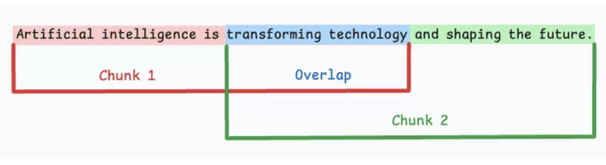
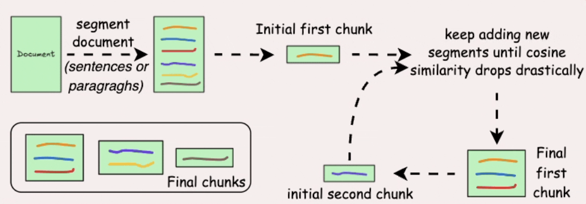
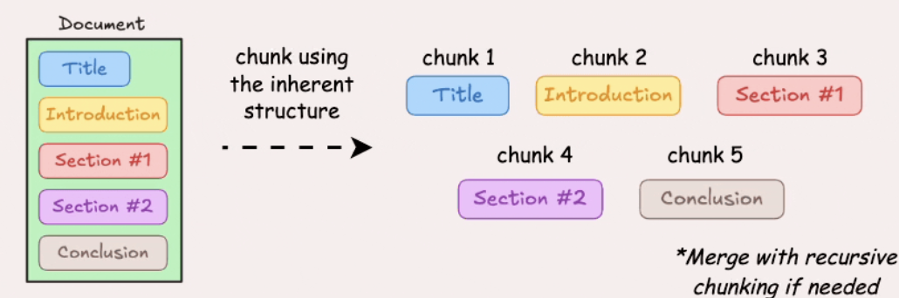
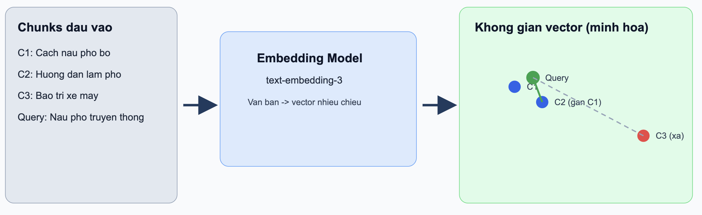

# 3. Quy Trình "Sơ Chế" Dữ Liệu (Góc nhìn của Data Architect)

Nếu Retrieval là “cỗ máy tìm kiếm”, thì dữ liệu chính là “nguyên liệu đầu vào”. Và giống như trong nấu ăn, nguyên liệu không được sơ chế kỹ thì dù bếp có xịn đến đâu, món ăn vẫn khó ngon.

Một hệ thống Retrieval hiệu quả không bắt đầu từ model, mà bắt đầu từ cách bạn **chuẩn bị dữ liệu**. Quy trình này thường xoay quanh 3 bước cốt lõi: **Chunking → Embedding → Indexing**.

## 3.1. Chunking – Chia nhỏ để giữ trọn ý nghĩa

Các mô hình AI không “đọc” văn bản như con người. Nếu bạn đưa cho hệ thống một tài liệu dài hàng chục trang, rất dễ xảy ra hai vấn đề:

* **Quá tải ngữ cảnh** (context overflow)
* **Làm loãng thông tin quan trọng**

Vì vậy, bước đầu tiên là **chia nhỏ tài liệu thành các đoạn (chunks)**.

**Các phương pháp chunking phổ biến:**

1. **Fixed-size chunking**  

Chia văn bản theo kích thước cố định (ký tự/từ/token), thường thêm `overlap` để giảm đứt mạch nội dung.  
Ưu điểm: Dễ triển khai, xử lý hàng loạt tốt.  
Nhược điểm: Dễ cắt ngang câu hoặc ý quan trọng.

2. **Semantic chunking**  

Chia theo đơn vị ngữ nghĩa (câu/đoạn), dùng embedding + similarity để gộp các phần liên quan.  
Ưu điểm: Chunk mạch lạc hơn, retrieval chính xác hơn.  
Nhược điểm: Phụ thuộc ngưỡng similarity và tốn compute hơn.

3. **Recursive chunking**  

Tách theo ranh giới tự nhiên (`\n\n`, `\n`, khoảng trắng), nếu còn quá dài thì tách đệ quy tiếp.  
Ưu điểm: Cân bằng giữa ngữ nghĩa và giới hạn kích thước.  
Nhược điểm: Triển khai phức tạp hơn fixed-size.

4. **Document structure-based chunking**  

Tận dụng cấu trúc tài liệu (heading, section, list, table, paragraph) để xác định ranh giới chunk.  
Ưu điểm: Giữ tốt logic tài liệu gốc.  
Nhược điểm: Phụ thuộc tài liệu có cấu trúc rõ; chunk có thể không đồng đều.

5. **LLM-based chunking**  

Dùng LLM xác định ranh giới chunk theo chủ đề/ý nghĩa hoàn chỉnh.  
Ưu điểm: Tiềm năng tốt nhất về chất lượng ngữ nghĩa.  
Nhược điểm: Chi phí cao, chậm hơn, phụ thuộc prompt và context window.

**Insight quan trọng:** Không có phương pháp “tốt nhất tuyệt đối”. Thực tế thường dùng **hybrid chunking** để cân bằng chất lượng, tốc độ và chi phí.

## 3.2. Embedding – Biến ngôn ngữ thành tọa độ

Sau khi có các chunks, bước tiếp theo là chuyển chúng thành dạng mà máy có thể “hiểu” và so sánh: **vector embeddings**.

Embedding model (ví dụ như `text-embedding-3`) sẽ biến mỗi đoạn văn thành một vector trong không gian nhiều chiều.

Điều này cho phép hệ thống:

* Đo lường **độ tương đồng ngữ nghĩa**
* Tìm các đoạn “có nghĩa giống nhau” dù không trùng từ

**Ví dụ thực tế (Embedding):**

Giả sử hệ thống có 3 chunks:

* `C1`: “Cách nấu phở bò tại nhà”
* `C2`: “Hướng dẫn nấu phở truyền thống”
* `C3`: “Mẹo bảo dưỡng xe máy mùa mưa”

Với query: “Làm sao nấu phở bò ngon?”

* `sim(query, C1) = 0.91`
* `sim(query, C2) = 0.88`
* `sim(query, C3) = 0.15`

Kết quả: hệ thống ưu tiên `C1`, `C2` vì gần nghĩa, dù câu chữ không trùng hoàn toàn.

**Insight quan trọng:**
Embedding chính là cầu nối giữa **ngôn ngữ con người** và **toán học của máy học**.

## 3.3. Indexing – Tổ chức để tìm kiếm trong mili-giây

Sau khi có vector, bạn cần một nơi để lưu trữ và truy xuất chúng thật nhanh — đó là lúc **Vector Database** xuất hiện.

Một số hệ phổ biến:

* Pinecone
* Milvus
* Weaviate

Khác với database truyền thống (SQL), vector database được tối ưu cho:

* **Tìm kiếm gần đúng (Approximate Nearest Neighbor - ANN)**
* Xử lý hàng triệu đến hàng tỷ vector với độ trễ thấp

**Quy trình indexing gồm:**

* Lưu vector + metadata (nguồn, tiêu đề, timestamp…)
* Tạo cấu trúc chỉ mục (index structure) để tăng tốc tìm kiếm
* Tối ưu cho truy vấn similarity (cosine similarity, dot product…)

**Ví dụ thực tế (Indexing + Retrieval):**

Giả sử bạn đã index 1 triệu chunks tài liệu nội bộ. Khi có câu hỏi “Chính sách hoàn tiền trong 30 ngày hoạt động thế nào?”:

1. Câu hỏi được embedding thành `q_vector`
2. Vector DB dùng ANN index để tìm `top-k` vector gần nhất trong mili-giây
3. Trả về các chunk liên quan nhất, ví dụ:
   * `chunk_2451` (score `0.93`) - mục hoàn tiền sản phẩm
   * `chunk_8712` (score `0.89`) - điều kiện áp dụng
   * `chunk_1022` (score `0.84`) - các trường hợp ngoại lệ

Các chunk này sẽ được đưa vào context cho LLM để tạo câu trả lời cuối cùng.

Khi người dùng đặt câu hỏi:

1. Câu hỏi được embedding thành vector
2. Hệ thống tìm các vector gần nhất trong database
3. Trả về các chunks liên quan nhất

## Retrieval tốt bắt đầu từ dữ liệu tốt

Ba bước này tạo thành nền tảng cho toàn bộ hệ thống Retrieval:

* **Chunking** → Quyết định *AI sẽ “nhìn” dữ liệu như thế nào*
* **Embedding** → Quyết định *AI “hiểu” dữ liệu ra sao*
* **Indexing** → Quyết định *AI tìm dữ liệu nhanh đến mức nào*

Nếu làm tốt phần này, bạn đã giải quyết được hơn 70% chất lượng của hệ thống RAG sau này.

Một câu nói đáng nhớ trong giới Data Architect:

> “Garbage in, garbage out — nhưng với Retrieval, nó là: *Chunk tệ, search sai; embedding kém, hiểu sai.*”

Tài liệu tham khảo: https://viblo.asia/p/toi-uu-hoa-rag-kham-pha-5-chien-luoc-chunking-hieu-qua-ban-can-biet-EvbLbPGW4nk
